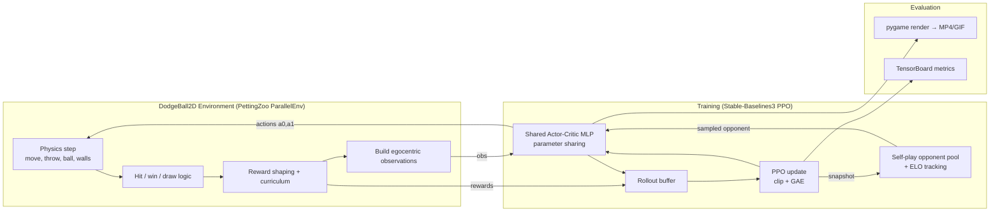
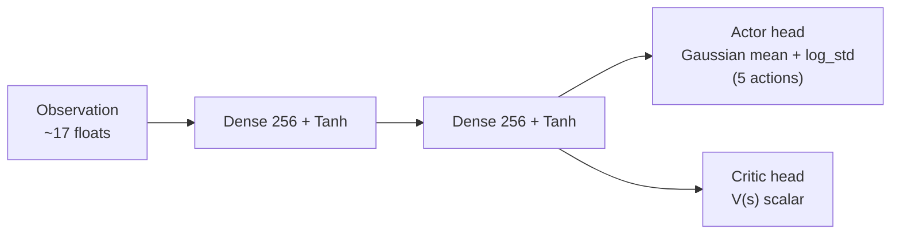
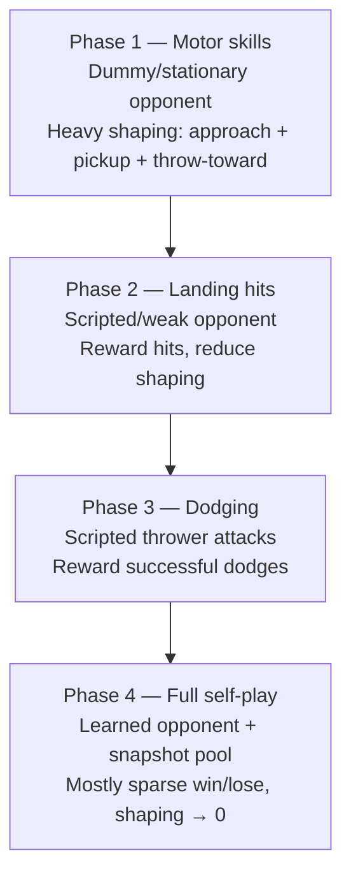
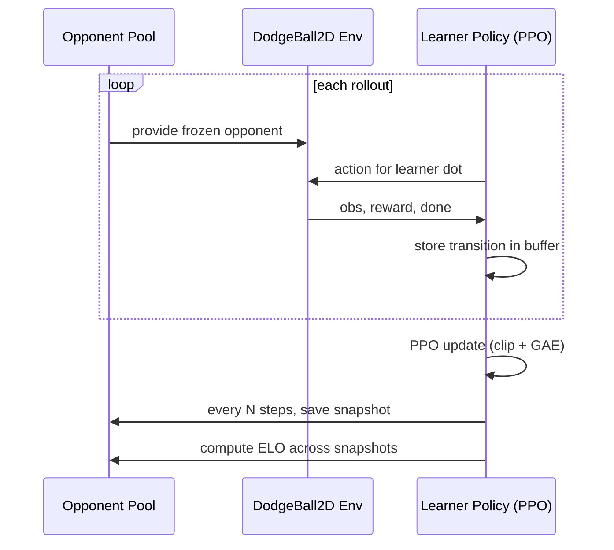

# 2D AI Dodgeball — Deep Reinforcement Learning Project Plan

> **Goal:** Recreate the spirit of AI Warehouse's *"1v10 AI Dodgeball"* video ([youtube.com/watch?v=8fICnUvIw6g](https://www.youtube.com/watch?v=8fICnUvIw6g)) as a **simplified 2D game** where **two dots** learn to play dodgeball against each other using **deep reinforcement learning (self-play)**.
>
> This document is written so it can be handed directly to a coding agent. It contains the references, environment design, model architecture, RL technique, "dataset" discussion, hyperparameters, repo layout, and an ordered, acceptance-criteria-driven task list.

---

## 0. TL;DR for the coding agent

- **Language/stack:** Python 3.10+, PyTorch, Gymnasium + PettingZoo, Stable-Baselines3 (PPO), SuperSuit, pygame (rendering), TensorBoard (logging).
- **Algorithm:** **PPO** (Proximal Policy Optimization) with **self-play** + **curriculum learning** + **reward shaping**.
- **Agents:** two dots in a 2D arena split by a center line; they pick up a ball, throw it at the opponent, and dodge incoming throws.
- **Dataset:** **None required.** RL generates its own training data by interacting with the environment. (See §3.)
- **Build order:** environment → render → sanity-check with random agents → single-agent vs. dummy (curriculum phase 1) → self-play → evaluation videos. (See §12–13.)

---

## 1. What the inspiration video does — and how we simplify

| Aspect | AI Warehouse video (Albert vs. Kai) | Our simplified 2D version |
|---|---|---|
| Engine | Unity ML-Agents (3D) | Python (Gymnasium/PettingZoo) in 2D |
| Agents | Humanoid-ish 3D characters | Two **dots** (circles) |
| Perception | Ray casts / vision in 3D | Low-dim **state vector** (positions, velocities) |
| Core loop | Pick up ball → throw at opponent → dodge | Same, but in a top-down 2D arena |
| Learning | Deep RL + self-play, reward/punishment | **PPO + self-play + curriculum** (same idea) |
| Training scale | Tens of millions of steps | Start at ~5M steps; scale up if time allows |

**Key insight from the video (and the research behind it):** the interesting behavior is *not* hand-coded. Two agents of similar skill competing against each other creates a **natural curriculum** — as one gets better, the other is forced to get better. This is exactly the finding of Bansal et al., *"Emergent Complexity via Multi-Agent Competition"* (see §16).

---

## 2. Recommended tech stack (and alternatives)

### ✅ Primary recommendation — **Option A: PettingZoo + SB3 (Python, fastest path)**
- **PettingZoo `ParallelEnv`** to model the two-agent simultaneous game cleanly.
- **SuperSuit** wrappers to vectorize and adapt it for Stable-Baselines3.
- **Stable-Baselines3 PPO** with **parameter sharing** (one network controls both symmetric dots).
- **pygame** for rendering and exporting match videos/GIFs.
- Best balance of "easy to code" + "correct multi-agent semantics" for a class project.

### Alternatives (document, but don't start here)
- **Option B — Custom Gymnasium env + SB3:** Wrap the 2-agent game as a single-agent Gym env where the opponent is a frozen copy of the current policy. Simplest possible loop; good if PettingZoo feels heavy.
- **Option C — Custom env + CleanRL PPO (single-file):** Most educational/transparent; gives you full control over the self-play opponent pool. Choose this if you want to *understand and own* every line of the RL loop.
- **Option D — Unity ML-Agents DodgeBall env:** Closest to the original video (it literally is the dodgeball example). Heaviest setup (Unity + C#). Use only if you specifically want 3D visuals matching the video.

> **Decision for this plan:** we proceed with **Option A**, and note the small deltas for B/C where relevant.

### Dependencies (`requirements.txt`)
```
gymnasium>=0.29
pettingzoo>=1.24
supersuit>=3.9
stable-baselines3>=2.3
sb3-contrib>=2.3
torch>=2.1
pygame>=2.5
numpy>=1.26
tensorboard>=2.15
imageio>=2.34
imageio-ffmpeg>=0.4
tqdm
```

---

## 3. "Do we need a dataset?" — Important conceptual note

**No external/static dataset is required.** This is the single most important thing to understand about this project:

- **Supervised learning** needs a labeled dataset.
- **Reinforcement learning** generates its own data by **interacting with the environment**. The agent takes actions, the environment returns the next state + reward, and these `(state, action, reward, next_state)` transitions *are* the training data. They are collected into a **rollout buffer** and discarded/refreshed each update (PPO is on-policy).

What you **do** persist instead of a dataset:
1. **Model checkpoints** (`.zip`/`.pt`) — the learned policy weights.
2. **Opponent snapshots** — frozen past policies for self-play (see §8.2).
3. **Logged metrics** — reward, episode length, win rate, ELO (TensorBoard).
4. **(Optional) Recorded episodes** — saved trajectories/videos for evaluation and your report.

> If you ever want a *warm start*, you could imitate a scripted bot (behavior cloning) — but this is a **stretch goal**, not required.

---

## 4. Game / Environment design

This is the heart of the project. Design it cleanly because everything else depends on it.

### 4.1 Arena & entities
- **Arena:** rectangle `W × H` (e.g., 800 × 400 units), walls on all sides.
- **Center line** at `x = W/2`. Player 0 is confined to the **left half**, Player 1 to the **right half** (classic dodgeball spatial constraint — keeps the problem well-defined and symmetric).
- **Agents:** two dots (circles), radius `r_agent`, each with position `(x, y)` and velocity `(vx, vy)`.
- **Ball:** one ball (start with one; multiple is a stretch goal), radius `r_ball`, with position, velocity, and a `held_by` state ∈ {`none`, `agent_0`, `agent_1`}.

### 4.2 Physics (keep it simple)
- Fixed timestep `dt` (e.g., 1/30 s). Optionally use **action repeat** (agent decides every `k` physics steps) to speed up learning.
- Movement: action applies acceleration or directly sets velocity, clamped to `max_speed`; apply light friction/damping.
- Ball in flight: constant velocity + **bounces off walls** (reflect velocity component). Optional drag.
- A free ball spawns at center (or last drop point). An agent within `pickup_radius` of a free ball (optionally requiring a "grab" action) picks it up; held ball follows the holder.
- **Hit detection:** if a ball **thrown by the opponent** (in flight, not held) overlaps an agent's circle → that agent is **hit**.

### 4.3 Rules / episode flow
- An agent holding the ball can **throw** it (aim direction + release). A thrown ball must generally cross the center line to threaten the opponent.
- **Episode ends when:** (a) a hit lands → thrower **wins**, target **loses**; or (b) **time limit** reached (`max_steps`, e.g., 1000–1800 steps) → **draw**.
- Reset places agents at default spots on their halves and the ball at center.

### 4.4 Observation space (per agent) — egocentric vector
Use a **normalized, egocentric** observation so the symmetric policy can be shared (mirror Player 1's frame so "forward" always means "toward the opponent"):

| Feature | Dims | Notes |
|---|---|---|
| Own position (x, y) | 2 | normalized to [-1, 1] |
| Own velocity (vx, vy) | 2 | normalized by max_speed |
| Opponent position (relative) | 2 | opponent − self |
| Opponent velocity | 2 | |
| Ball position (relative) | 2 | ball − self |
| Ball velocity | 2 | |
| Ball ownership | 3 | one-hot: free / I-hold / opp-holds |
| Holding flag | 1 | redundant but helpful |
| Time remaining | 1 | normalized [0,1] |
| **Total** | **~17** | low-dim → **MLP**, no CNN needed |

> **Variant (stretch):** a "vision" version using ray-casts (like ML-Agents) or a pixel/`rgb_array` observation processed by a CNN. Not recommended for the first working version.

### 4.5 Action space (per agent)
**Primary — continuous (`Box`), 5 dims**, all in [-1, 1]:
- `a[0], a[1]` → desired move direction/force in x, y
- `a[2], a[3]` → aim direction (normalized to a unit vector at throw time)
- `a[4]` → throw trigger (throw if `a[4] > 0` **and** holding the ball)

> **Simpler fallback — discrete (`MultiDiscrete` or `Discrete`):** `{noop, up, down, left, right}` for movement × `{no-throw, throw-in-aim-bucket_i}`. Easier to learn first, less expressive. Continuous is recommended for the final version.

### 4.6 Reward function (the make-or-break part)
Use **sparse terminal rewards** + **dense potential-based shaping** that you **anneal away** over the curriculum. Make every coefficient a config constant.

**Terminal (always on):**
```
hit_opponent      = +10.0     # you hit them
got_hit           = -10.0     # they hit you
timeout (draw)    =  -1.0     # mild penalty to discourage stalling
```

**Dense shaping (strong in early phases, annealed later):**
```
# Encourage getting the ball when it's free (potential-based: Δ distance)
approach_ball     = +k1 * (prev_dist_to_ball - dist_to_ball)     # k1 ≈ 0.01
pickup_ball       = +1.0
# While holding: reward aiming/throwing toward the opponent
throw_alignment   = +k2 * max(0, cos(angle(throw_dir, dir_to_opp)))   # k2 ≈ 1.0, on throw
near_miss_bonus   = +k3 * (1 - min(1, closest_approach/threshold))    # thrown ball passes near opp
# Defender: reward dodging an incoming throw
dodge_progress    = +k4 * (dist_increase_from_predicted_impact)
# Keep games decisive
time_penalty      = -0.001 per step
```

> Use **potential-based shaping** (Ng et al., 1999) where possible — shaping of the form `γΦ(s') − Φ(s)` does not change the optimal policy, so it won't teach degenerate habits.

**Watch for reward hacking:** e.g., agent throws the ball straight into a wall to farm `throw_alignment`, or stalls to avoid `got_hit`. Mitigate by keeping terminal rewards dominant and annealing shaping to ~0 by the final phase.

---

## 5. System architecture



---

## 6. Model architecture

Low-dimensional vector observations → a small **Multi-Layer Perceptron (MLP) Actor-Critic**. No CNN needed.

- **Input:** ~17-dim observation vector (per agent), normalized (`VecNormalize`).
- **Shared trunk (optional) / separate heads:**
  - **Policy (actor) head:** outputs the **mean** (and a learned **log-std**) of a Gaussian for the 5 continuous actions. For discrete actions, outputs logits.
  - **Value (critic) head:** outputs a scalar state-value `V(s)`.
- **Hidden layers:** `[256, 256]` (start), **Tanh** activation (PPO default; stable).
- **Parameter sharing:** ONE network controls both dots. Because the game is symmetric and observations are egocentric, the same policy plays both sides — this is the standard, simplest self-play setup.

SB3 spec:
```python
policy_kwargs = dict(
    net_arch=dict(pi=[256, 256], vf=[256, 256]),
    activation_fn=torch.nn.Tanh,
)
```



---

## 7. RL technique: PPO + self-play + curriculum

### 7.1 Why PPO
- **On-policy**, stable, robust to hyperparameters, handles continuous **and** discrete actions, and is the de-facto standard for self-play games (used in OpenAI Five, the ML-Agents dodgeball example, etc.). It adapts well to the **non-stationary** opponent created by self-play because it re-collects fresh data each update.
- Uses **clipped surrogate objective** + **Generalized Advantage Estimation (GAE)**.

### 7.2 Self-play strategy
Start simple, then harden:

1. **Symmetric parameter-sharing self-play (start here):** one policy plays both dots; it improves against its own current behavior.
2. **Opponent pool / snapshots (add next, à la Bansal et al. & ML-Agents):**
   - Every `snapshot_interval` steps, save a frozen copy of the policy to a pool.
   - When collecting episodes, sample the opponent: ~**80% latest policy**, ~**20% from older snapshots**. This prevents *cycling* (rock-paper-scissors forgetting) and *overfitting* to the current self.
   - Swap/refresh the "main" opponent when the learner's win rate vs. it exceeds ~**0.7**.
3. **ELO rating:** compute an ELO score across snapshots to **measure real progress** (win rate vs. the *current* self is always ~50% and tells you nothing). The ML-Agents dodgeball example tracks exactly this.

> In SB3 (Option A/B) the simplest implementation: maintain a list of saved models; in the env, hold a frozen `opponent_model` and periodically reload it from the pool. Option C (CleanRL) makes the pool fully explicit and is the cleanest place to implement league play.

### 7.3 Curriculum learning (phased reward + opponent difficulty)
Don't throw two clueless agents at each other and hope. Stage it:



Advance a phase when a metric threshold is met (e.g., pickup rate > 80%, or hit rate > 30%, or win rate vs. scripted bot > 70%). Make thresholds config-driven.

### 7.4 Starting hyperparameters (PPO, continuous control)

| Hyperparameter | Start value | Notes |
|---|---|---|
| `total_timesteps` | 5e6 (then scale to 2e7+) | first results, then longer |
| `n_envs` (parallel) | 8–16 | more = faster, smoother |
| `n_steps` (per env) | 2048 | rollout length |
| `batch_size` | 4096 | |
| `n_epochs` | 10 | PPO update passes |
| `gamma` | 0.99 | discount |
| `gae_lambda` | 0.95 | GAE |
| `clip_range` | 0.2 | PPO clip |
| `ent_coef` | 0.01 → 0.0 | exploration, anneal down |
| `vf_coef` | 0.5 | |
| `learning_rate` | 3e-4 (linear decay) | |
| `max_grad_norm` | 0.5 | |
| `net_arch` | [256, 256] | |
| `activation` | Tanh | |
| Obs normalization | `VecNormalize` on | important |

> Reference for getting PPO details exactly right: *"The 37 Implementation Details of PPO"* (see §16).

---

## 8. Training loop (pseudocode)

```python
# Option A (PettingZoo + SuperSuit + SB3), parameter-sharing self-play
env = DodgeBall2DParallelEnv(curriculum_phase=1)
env = supersuit.pettingzoo_env_to_vec_env_v1(env)
env = supersuit.concat_vec_envs_v1(env, num_vec_envs=8, base_class="stable_baselines3")
env = VecMonitor(VecNormalize(env, norm_obs=True, norm_reward=False))

model = PPO("MlpPolicy", env, **ppo_hyperparams, tensorboard_log="runs/")

opponent_pool = []
for phase in [1, 2, 3, 4]:
    env.set_curriculum_phase(phase)              # adjust rewards + opponent type
    for chunk in range(num_chunks_in_phase):
        model.learn(total_timesteps=chunk_size, reset_num_timesteps=False)
        if step % snapshot_interval == 0:
            path = save_snapshot(model)          # freeze a copy
            opponent_pool.append(path)
            env.set_opponent(sample_opponent(opponent_pool))  # 80% latest / 20% old
        log_metrics(win_rate, episode_len, elo)
        if phase_threshold_met(): break

model.save("models/dodgeball_final")
record_match_video(model, "videos/final_match.mp4")
```



---

## 9. Evaluation & visualization

Track and plot (TensorBoard):
- **Win / loss / draw rate** vs. each opponent type (scripted bot, latest self, snapshot pool).
- **ELO** across snapshots (the real progress signal).
- **Episode length** (should stabilize, not collapse to instant losses).
- **Mean episode reward** and the breakdown by reward component (log shaping vs. terminal separately).
- **Hit accuracy / dodge success rate** (custom metrics).

Qualitative:
- Render matches with **pygame** and export **MP4/GIF** with `imageio`. Save a clip per phase to *show the learning progression* — this is the money shot for your class presentation, just like the video.
- Build an **eval script** that plays N deterministic matches and reports aggregate stats.

---

## 10. Repository structure

```
ai-dodgeball-2d/
├── README.md
├── requirements.txt
├── configs/
│   ├── env.yaml            # arena size, speeds, radii, max_steps
│   ├── rewards.yaml        # reward coefficients per curriculum phase
│   └── ppo.yaml            # PPO hyperparameters
├── dodgeball/
│   ├── __init__.py
│   ├── env/
│   │   ├── dodgeball_parallel.py   # PettingZoo ParallelEnv
│   │   ├── physics.py              # movement, ball, walls, collisions
│   │   ├── entities.py             # Agent, Ball dataclasses
│   │   └── rewards.py              # reward + curriculum logic
│   ├── render/
│   │   └── pygame_renderer.py      # draw arena, dots, ball; frame export
│   ├── selfplay/
│   │   ├── opponent_pool.py        # snapshots + sampling
│   │   └── elo.py                  # ELO computation
│   ├── scripted/
│   │   └── bots.py                 # stationary / random / heuristic opponents
│   └── wrappers.py                 # SuperSuit / VecNormalize setup
├── scripts/
│   ├── sanity_random.py    # run env with random actions, render
│   ├── train.py            # main training entrypoint (curriculum loop)
│   ├── evaluate.py         # N matches, aggregate stats
│   └── record_video.py     # export MP4/GIF of a match
├── tests/
│   ├── test_env_api.py     # pettingzoo parallel_api_test
│   ├── test_physics.py     # walls, collisions, hit detection
│   └── test_rewards.py     # reward signs & terminal conditions
├── models/                 # checkpoints (gitignored)
├── runs/                   # tensorboard logs (gitignored)
└── videos/                 # exported clips (gitignored)
```

---

## 11. Implementation roadmap / milestones

| Milestone | Deliverable | "Done" when… |
|---|---|---|
| **M0 — Setup** | repo + deps + configs | `pip install -r requirements.txt` works; configs load |
| **M1 — Environment** | `DodgeBall2DParallelEnv` | passes PettingZoo `parallel_api_test`; random agents run without errors |
| **M2 — Rendering** | pygame renderer | you can watch random dots + ball move and bounce |
| **M3 — Reward + curriculum** | `rewards.py` | unit tests confirm terminal + shaping signs; phases switchable |
| **M4 — Phase 1 training** | motor skills | agent reliably picks up ball & throws toward opponent half |
| **M5 — Phases 2–3** | hit + dodge | agent lands hits on scripted bot; dodges scripted throws |
| **M6 — Self-play** | opponent pool + ELO | ELO rises over training; emergent back-and-forth play |
| **M7 — Eval + video** | clips + metrics | progression video per phase + TensorBoard report |
| **M8 — Report** | write-up | architecture, results, plots, references |

---

## 12. Ordered task list for the coding agent (handoff)

> Each task has **acceptance criteria**. Do them in order; don't start RL until the env is verified.

1. **Scaffold the repo** exactly as in §10. Create `requirements.txt` (§2) and stub configs in `configs/`.
   - ✅ `pip install -r requirements.txt` succeeds; `python -c "import dodgeball"` works.
2. **Implement entities & physics** (`entities.py`, `physics.py`): agent movement with `max_speed`/friction, ball flight + wall bounces, pickup logic, hit detection, center-line constraint.
   - ✅ Unit tests in `tests/test_physics.py` pass (ball reflects off walls; hit detected on overlap; agents stay in their half).
3. **Implement `DodgeBall2DParallelEnv`** (PettingZoo `ParallelEnv`) with `reset`, `step`, `observation_space`, `action_space`, `render`. Observations per §4.4 (egocentric, mirrored for player 1); actions per §4.5 (continuous Box, 5 dims).
   - ✅ `pettingzoo.test.parallel_api_test(env)` passes.
4. **Random-agent sanity script** (`scripts/sanity_random.py`) + **pygame renderer**.
   - ✅ You can watch two dots move randomly, grab and throw the ball, and episodes terminate on hit/timeout.
5. **Implement rewards + curriculum** (`rewards.py`) reading `configs/rewards.yaml`; expose `set_curriculum_phase(phase)`.
   - ✅ `tests/test_rewards.py` confirms: +10 on hit, -10 on got-hit, shaping has correct sign, coefficients change per phase.
6. **Scripted opponents** (`scripted/bots.py`): `StationaryBot`, `RandomBot`, `HeuristicThrowerBot` (aims at opponent), `HeuristicDodgerBot`.
   - ✅ Each bot runs in the env via the same action interface.
7. **Wrappers** (`wrappers.py`): SuperSuit `pettingzoo_env_to_vec_env_v1` → `concat_vec_envs_v1` → `VecMonitor` + `VecNormalize`.
   - ✅ An SB3 `PPO("MlpPolicy", wrapped_env)` constructs and runs `model.learn(1000)` without error.
8. **Training entrypoint** (`scripts/train.py`): PPO with §7.4 hyperparameters; curriculum loop over phases; TensorBoard logging; checkpointing.
   - ✅ Phase 1 training runs; TensorBoard shows rising pickup/throw-toward reward; checkpoints saved.
9. **Self-play** (`selfplay/opponent_pool.py`, `elo.py`): snapshot every `snapshot_interval`; sample opponent 80% latest / 20% old; swap when win rate > 0.7; track ELO.
   - ✅ ELO trends upward over training; opponent reloads work without crashing.
10. **Evaluation** (`scripts/evaluate.py`): play N deterministic matches vs. each opponent type; report win/draw/loss, episode length, hit/dodge rates.
    - ✅ Produces a clean stats table.
11. **Video export** (`scripts/record_video.py`): render a match to MP4/GIF; export one clip per curriculum phase.
    - ✅ Watchable clips showing the learning progression.
12. **README + report**: how to install/train/eval, results plots, and the references from §16.
    - ✅ A teammate can reproduce a run from the README alone.

---

## 13. Risks, pitfalls & debugging tips

- **Don't skip env verification.** ~80% of RL bugs are environment bugs (wrong reward sign, broken termination, observation leakage). Use the random-agent + render sanity check and the `parallel_api_test`.
- **Overfit a trivial task first.** Before full self-play, confirm the agent can learn to walk into a stationary ball and throw it at a stationary target. If it can't, RL won't fix a broken reward.
- **Self-play non-stationarity & cycling.** The opponent keeps changing, so win-rate-vs-current-self ≈ 50% always. Use the **snapshot pool + ELO** to measure real progress and prevent catastrophic forgetting.
- **Reward hacking.** Keep terminal rewards dominant; anneal shaping to ~0 by Phase 4; log reward components separately to catch exploits early.
- **Sparse reward early on.** That's why we use dense shaping + curriculum in Phases 1–3.
- **Normalize observations** (`VecNormalize`) — big stability win. Save/restore its statistics with the model.
- **Seeds & determinism.** Seed env, NumPy, and PyTorch; log seeds for reproducible runs in your report.
- **Compute budget.** Start at 5M steps with 8 parallel envs to iterate fast; only scale to tens of millions once the pipeline is proven. Use action-repeat to get more "game time" per compute.
- **Start discrete if continuous stalls.** If the 5-dim continuous action is hard to learn, drop to the discrete fallback (§4.5), get it working, then switch back.

---

## 14. Stretch goals (after the core works)

- **Catching mechanic:** defender can "catch" an incoming ball with a timed grab → reverses possession (adds risk/reward depth).
- **Multiple balls** in play.
- **Ray-cast or pixel (CNN) observations** to mirror the video's vision-based perception.
- **League play** (AlphaStar-style): multiple distinct policies + exploiters, not just snapshots.
- **Behavior cloning warm start** from a scripted bot before RL.
- **Obstacles/cover** in the arena (like the hedges in the Unity dodgeball env).
- **Interactive demo:** let a human play one dot against the trained policy (pygame keyboard input).

---

## 15. References

### The inspiration video
- **AI Warehouse — "1v10 AI Dodgeball (deep reinforcement learning)"** — https://www.youtube.com/watch?v=8fICnUvIw6g
- AI Warehouse — "AI Learns to Play Dodgeball!" — https://www.youtube.com/watch?v=lgn5dgSkee0

### Closest reference implementation (the actual dodgeball example)
- **Unity ML-Agents — DodgeBall environment** (self-play, MA-POCA, ELO) — https://github.com/Unity-Technologies/ml-agents-dodgeball-env
- Unity blog — "ML-Agents plays DodgeBall" — https://unity.com/blog/engine-platform/ml-agents-plays-dodgeball
- Unity ML-Agents Toolkit — https://github.com/Unity-Technologies/ml-agents

### Foundational research — competitive self-play & emergent behavior
- **Bansal et al. (2018), "Emergent Complexity via Multi-Agent Competition"** — https://arxiv.org/abs/1710.03748 · code: https://github.com/openai/multiagent-competition
- Baker et al. (2019), "Emergent Tool Use from Multi-Agent Autocurricula" (OpenAI Hide-and-Seek) — https://arxiv.org/abs/1909.07528
- OpenAI Five (large-scale self-play with PPO) — https://openai.com/research/openai-five

### Curriculum + self-play for competitive games (great for your write-up)
- Multi-Agent Training for Pommerman: Curriculum + Population-based Self-Play — https://arxiv.org/html/2407.00662
- TiZero: Mastering Multi-Agent Football with Curriculum Learning and Self-Play — https://arxiv.org/abs/2302.07515

### Algorithm
- **PPO — Schulman et al. (2017), "Proximal Policy Optimization Algorithms"** — https://arxiv.org/abs/1707.06347
- GAE — Schulman et al. (2015), "High-Dimensional Continuous Control Using Generalized Advantage Estimation" — https://arxiv.org/abs/1506.02438
- "The 37 Implementation Details of Proximal Policy Optimization" — https://iclr-blog-track.github.io/2022/03/25/ppo-implementation-details/
- Potential-based reward shaping — Ng, Harada, Russell (1999), "Policy Invariance under Reward Transformations"

### Libraries & tutorials (your actual toolbox)
- Stable-Baselines3 — https://stable-baselines3.readthedocs.io/ · PPO: https://stable-baselines3.readthedocs.io/en/master/modules/ppo.html
- PettingZoo — https://pettingzoo.farama.org/ · Parallel API: https://pettingzoo.farama.org/api/parallel/
- PettingZoo custom environment tutorial — https://pettingzoo.farama.org/tutorials/custom_environment/index.html
- PettingZoo + SB3 tutorial (parameter sharing, vectorized self-play) — https://pettingzoo.farama.org/tutorials/sb3/index.html
- Gymnasium custom environment tutorial — https://gymnasium.farama.org/introduction/create_custom_env/
- SuperSuit (vectorization/wrappers) — https://github.com/Farama-Foundation/SuperSuit
- CleanRL (single-file PPO, great for Option C) — https://github.com/vwxyzjn/cleanrl · docs: https://docs.cleanrl.dev/
- pygame — https://www.pygame.org/docs/

### Learning resources (background)
- OpenAI Spinning Up in Deep RL — https://spinningup.openai.com/
- Sutton & Barto, *Reinforcement Learning: An Introduction* (2nd ed.) — http://incompleteideas.net/book/the-book-2nd.html

---

## 16. Glossary

- **PPO** — Proximal Policy Optimization; stable on-policy policy-gradient algorithm.
- **Actor-Critic** — network with a policy head (actor) and a value head (critic).
- **GAE** — Generalized Advantage Estimation; lower-variance advantage estimates for policy gradients.
- **Self-play** — agent trains against itself / past versions of itself.
- **Parameter sharing** — one network controls multiple (symmetric) agents.
- **Curriculum learning** — gradually increase task difficulty (easy → hard).
- **Reward shaping** — extra dense rewards to guide learning toward the sparse goal.
- **ELO** — relative skill rating; here used to measure progress across self-play snapshots.
- **Rollout buffer** — on-policy storage of recently collected transitions used for each PPO update.
- **Non-stationarity** — the environment's dynamics (the opponent) change as it learns, making the target a moving one.

---

*Plan generated to be directly executable by a coding agent. Recommended starting point: complete §12 tasks 1–4 (a verified, watchable environment) before writing any RL code.*
